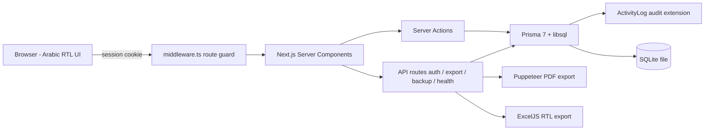

# FleetTrack-Logistics

**Real-Time Fleet & Logistics Management Suite**

> A self-hosted, single-tenant fleet and logistics management suite: a Next.js 16 App Router / React 19 server-rendered application backed by Prisma 7 over a local libsql (SQLite) store, unifying the fleet registry and truck-status lifecycle, driver-assignment history, revenue/expense ledgers, payroll, and audited financial reporting with PDF/Excel export under one authenticated session — with zero external services.

## At a Glance

| | |
| --- | --- |
| Domain | Fleet, logistics, payroll and financial operations |
| Architecture | Single-process Next.js App Router — zero external services |
| Backend | Server Components + Server Actions + API routes (auth / export / backup / health) |
| Frontend | React 19 · Tailwind CSS 4 · Radix UI · Arabic-first RTL |
| Database | SQLite via libsql (Prisma 7 driver adapter) — single file |
| Data layer | Prisma client extension writes every mutation to an immutable `ActivityLog` |
| Reporting | PDF (Puppeteer) and Excel (ExcelJS) export, browser print |
| Security | scrypt hashing, HMAC-signed `HttpOnly` sessions, `middleware.ts` route guard |
| Quality | Strict TypeScript, ESLint, typecheck CI gate |

## What It Solves

- Operators manage the full fleet lifecycle — trucks, statuses, and maintenance — in table and Kanban views under one authenticated session.
- Dispatch and finance teams track revenue, expenses, and per-truck profitability without exporting to separate tools.
- Payroll runs monthly across three salary schemes (fixed, per-trip, revenue-share), computed as `net = base − deductions − advances`.
- Management receives audited financial reports (income statement) exported to PDF and Excel with Arabic/RTL formatting intact.
- The entire suite runs on one machine with a single SQLite file — no database server, queues, or cloud accounts.

## Architecture



## Engineering Highlights

- **Monetary precision** — all amounts stored as integer minor units (1/100) and computed with decimal.js, eliminating float rounding error.
- **Auditable by design** — every create/update/delete is written to an immutable `ActivityLog` through a Prisma client extension; full JSON backup with transaction-scoped restore.
- **Secure auth primitives** — scrypt password hashing with timing-safe comparison and HMAC SHA-256 signed session tokens via Web Crypto (Node + Edge compatible).
- **Server-first rendering** — data access stays on the server; client components are limited to interactive widgets.
- **RTL-native** — bilingual schema labels, Arabic typography (Cairo / Tajawal), persisted theme, configurable brand colors.


---

## Architecture Overview

FleetTrack-Logistics is a single synchronous system designed to run fully on one machine. Next.js Server Components read directly through Prisma; mutations execute in Server Actions; specialized operations (auth, PDF/Excel export, backup, health) live in API routes; and one `middleware.ts` enforces session-based route protection. The data layer is a Prisma client extended with query middleware that writes every create/update/delete to an immutable `ActivityLog`, with auditing suppressed only during backup restore.

- **Single-process runtime** — no separate database server, queue, or cloud account; the SQLite file is the only durable store.
- **Server-first rendering** — data access stays on the server; client components are limited to interactive widgets.
- **Arabic-first (RTL) UI** — bilingual schema labels, Arabic fonts (Cairo for UI, Tajawal for print), persisted light/dark theme, configurable brand colors.
- **Auditable by design** — every mutation is recorded; full JSON backup and transaction-scoped restore.

## Core Capabilities & Key Technical Specifications

- **Fleet registry** — trucks keyed by unique plate number with model, year, purchase date/value, and a status lifecycle (`Operational | Maintenance | Stopped`); soft-delete via `deletedAt`; indexed on `status` and `deletedAt`; Table and Kanban views.
- **Driver & workforce management** — employees with role, three salary schemes (monthly fixed, per-trip, revenue-share), and dated `TruckDriverAssignment` records preserving assignment history.
- **Revenue & expense ledgers** — revenue typed as freight / monthly contract / truck rental per truck and date; expenses attach to a truck or to the general ledger via dynamic categories; high-frequency fields (`truckId`, `categoryId`, `date`, `deletedAt`) indexed.
- **Payroll** — monthly sheets computed as `net = baseAmount − deductions − advances`, with `@@unique([employeeId, month])` enforcing one record per employee per month and indexed `month`.
- **Financial reporting** — income statement aggregating revenues, direct expenses, overhead, payroll, and net profit over a date range; export to PDF via Puppeteer (embedded Tajawal font) and Excel via ExcelJS (RTL formatting); browser print.
- **Monetary precision** — all amounts stored as integer minor units (1/100) and computed through `decimal.js`, eliminating float rounding error.
- **Auth & sessions** — scrypt password hashing (16-byte salt, 64-byte digest, timing-safe comparison), HMAC SHA-256 signed session tokens via Web Crypto (Node + Edge compatible), 7-day expiry, `HttpOnly` cookie.
- **Audit & backup** — `ActivityLog` written by a Prisma client extension; JSON export/import within a single database transaction.

## Stack & Infrastructure Matrix

| Layer | Technology | Specification |
|-------|------------|---------------|
| Framework | Next.js 16.2.10 | App Router, Server Components, Server Actions, API routes, `middleware.ts` route protection |
| UI Runtime | React 19.2.4 | Server-first rendering; scoped client components |
| Language | TypeScript 5.x | Strict typing across `src/` |
| ORM / Data Access | Prisma 7.8 + `@prisma/adapter-libsql` | Driver adapter (Prisma 7 dropped the embedded engine); client extension for audit logging |
| Database | SQLite via libsql (WASM) | Single file `dev.db`, `file:` URI, no DB server |
| Styling / Components | Tailwind CSS 4, Radix UI | Utility-first CSS; shadcn-style accessible primitives; native RTL + dark mode |
| Monetary math | decimal.js 10.6 | Integer minor-unit storage; exact decimal arithmetic |
| PDF export | Puppeteer 25.3 | Server-side HTML→PDF with embedded Arabic font |
| Excel export | ExcelJS 4.4 | RTL-aware spreadsheet generation |
| Auth / Crypto | Node `crypto` + Web Crypto | scrypt hashing; HMAC SHA-256 sessions |
| Theming / Icons | next-themes 0.4, lucide-react | Persisted theme switching, icon set |

## Getting Started / Setup & Deployment

Prerequisites: **Node.js ≥ 20** (built on Node 24), npm.

```bash
# 1. Install dependencies
npm install

# 2. Configure environment
cp .env.example .env
# edit .env — see "Environment Variables" below

# 3. Create and migrate the database
npx prisma migrate dev
# or, to apply the schema without a migration history:
# npx prisma db push

# 5. Start the development server (hot reload)
npm run dev
```

Open http://localhost:3000. Default credentials: username `admin`, password `admin123` (bootstrapped via `ensureDefaultUser` on first start). In **production** the first login with the default password is **forced to change it** before any other page becomes accessible; in development the default login is kept for convenience.

### Environment Variables

| Variable | Purpose | Notes |
|----------|---------|-------|
| `DATABASE_URL` | SQLite file path for Prisma CLI / migrations | `file:./dev.db` |
| `AUTH_SECRET` | HMAC session signing secret, ≥ 32 chars | Read by `src/lib/session.ts`; **required in production** — production fails closed (refuses to sign sessions) when it is missing; the hardcoded fallback is used only in development |

```env
DATABASE_URL="file:./dev.db"
AUTH_SECRET="a-random-secret-string-at-least-32-characters-long"
```

> The committed `.env.example` ships the correct variable name: `AUTH_SECRET`. Set it to a long random string for every deployment (and always for production, where a missing value makes the app fail closed).

### Scripts

| Script | Command | Description |
|--------|---------|-------------|
| `dev` | `next dev` | Development server with hot reload |
| `build` | `next build` | Production build |
| `start` | `next start` | Serve the production build |
| `lint` | `eslint` | ESLint across the codebase (next core-web-vitals + TS) |

Production deployment:

```bash
npm run build
npm run start
```

There is currently no configured test suite (no `test` script in `package.json`); Playwright ships as a dev dependency for screenshot tooling.

## Security & Governance

- **Password storage** — scrypt with a fresh 16-byte random salt per password and a 64-byte digest; verified with `crypto.timingSafeEqual`; the well-known default password is blocked from being re-used and is **forced to change on first login in production**.
- **Session integrity** — tokens signed with HMAC SHA-256, constant-time verification, 7-day max age, `HttpOnly` cookie; all routes except login and report exports gated by Middleware.
- **Secret hygiene** — signing secret injected at runtime via `AUTH_SECRET`; production **fails closed** when it is missing instead of silently falling back to the development-only secret (the hardcoded value is dev-convenience only and never used in production).
- **Audit trail** — every create/update/delete (including soft-deletes) recorded to `ActivityLog` by Prisma query middleware; recording is suspended during backup restore to avoid flooding the log.
- **Backup safety** — full-system JSON export; restore executes within a single database transaction.
- **Tenancy posture** — single-tenant by design; there is no cross-tenant isolation surface, which keeps the trust boundary to one operator and one machine.

---

## License

MIT License — Copyright © 2026 Hamed Elaraby.
